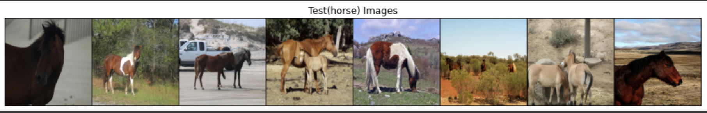
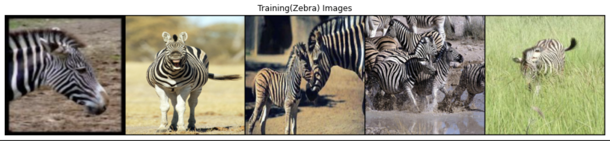
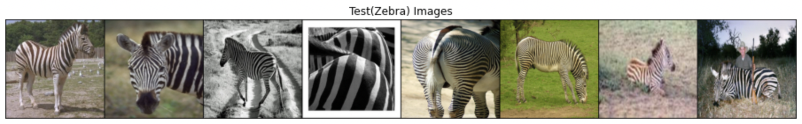
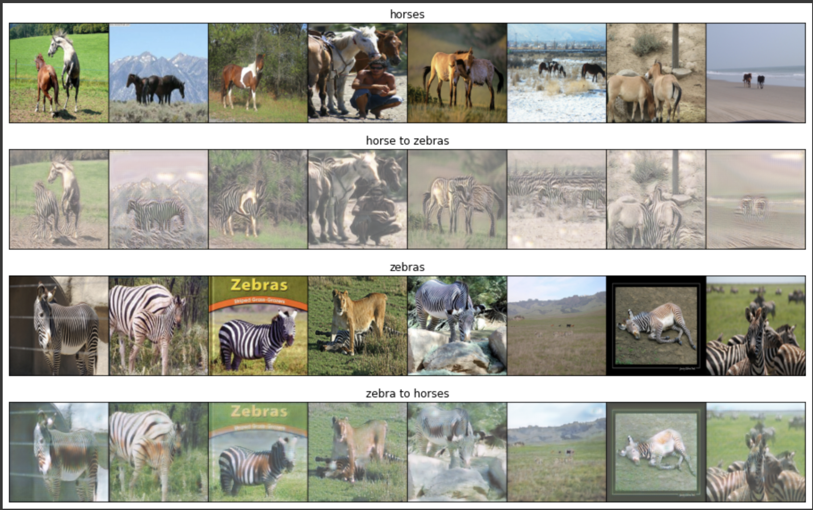

# Image-to-Image Translation using Cycle-Consistent Adversarial Networks (Cycle GAN)

<h2> Input data: </h2>

<h5> horse images </h5>

<h5> zebra images </h5>

<h2> Result </h2>

<h5> zebra to horse and horse to zebra </h5>

